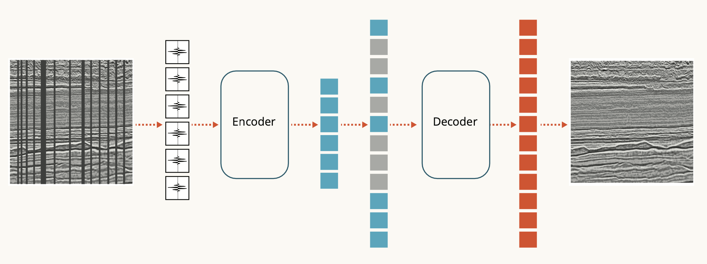

# Geophysical Foundation Model

Welcome to the Geophysical Foundation Model (GFM) repository! This repository is designed to help you explore, understand, and use the Geophysical Foundation Model.

## Table of Contents
1. [How to Fork and Clone the Repository](#how-to-fork-and-clone-the-repository)
2. [Getting Started](#getting-started)
3. [Running the Model](#running-the-model)
4. [Contributing](#contributing)
5. [Model Details](#model-details)
6. [Uses](#uses)
7. [Training Details](#training-details)
8. [Evaluation](#evaluation)
9. [Citations](#citations)
10. [Contact](#model-card-contact)

## How to Fork and Clone the Repository

If you want to work on this repository or make changes follow the instructions provided below. 

### Step 1: Fork the Repository
To fork the repository to your GitHub account:

1. Go to the [Geophysical Foundation Model repository page](https://github.com/thinkonward/geophysical-foundation-model).
2. Click the "Fork" button located at the top right corner of the repository.

### Step 2: Clone the Forked Repository
Once you have forked the repository, you can clone it to your local machine.

1. Open a terminal or command prompt.
2. Navigate to the directory where you want to store the cloned repository.
3. Run the following command to clone the forked repository (remember to change yourusername to your actual GitHub username):

```bash
git clone git@github.com:yourusername/geophysical-foundation-model.git
```

### Step 3: Change into the newly cloned directory:

```bash
cd geophysical-foundation-model
```

### Step 4: Create a new branch 

Before making changes to the repository, it’s a good practice to create a new branch for your work. This keeps your main codebase clean and organized.

1. Create a new branch using the following command. Replace `feature-my-feature` with your desired branch name:

```bash
git checkout -b feature-my-feature
```

2. Now you are working on a separate branch and can make changes without affecting the main codebase.

## Getting Started

Now that you have forked and cloned the repository to your local machine and have created a new branch, you can start exploring the contents.

### Directory Structure
The project is organized as follows:
- `GFM/`: Contains model architecture.
- `src_imgs/`: images used in the repository.
- `Tutorial/`: A Jupyter notebook to get you started with the model.
- `README.md`: This file.
- `LICENSE`: The open source license file.
- `requirements.txt`: Dependencies for the model.

## Running the Model

1. Ensure you have Python (>3.10) installed on your system.
2. Start from the `geophysical-foundation-model` directory in the terminal.
3. Create a new virtual environment
```bash
conda create -n geophysics python=3.10 
```
3. After creation, activate the newly created environment:

```bash
conda activate geophysics
```
4. Install the required dependencies by running:

```bash
pip install -r requirements.txt
```
5. Start up a Jupyterlab notebook and get started with the tutorial in the `Tutorial` directory. To start a notebook server from the terminal run

```bash
jupyter lab
```

And open `Tutorial/GFM_webinar.ipynb` to learn more about data processing.


6. For advanced users, you can download the model weights from HuggingFace and load them into an instance of the model in Python after you have requested access on HuggingFace.

```python
# import the architecture from the GitHub repository
from GFM import ElasticViTMAE
model = ElasticViTMAE.ElasticViTMAE.from_pretrained("thinkonward/geophysical-foundation-model")

```

## Contributing

We welcome contributions from anyone interested in improving this project! To contribute to the model use the following steps:

1. Fork the repository.
2. Create a new branch for your changes:

```bash
git checkout -b feature/my-feature
```

3. Make your changes and commit them:

```bash
git add .
git commit -m "Add my feature"
```

4. Push your changes to your forked repository:

```bash
git push origin feature/my-feature
```

5. Create a pull request from your forked repository back to the original repository.

Thank you for contributing to the Geophysical Foundation Model 


## Model Details

### Model Description

ThinkOnward's Geophysical Foundation Model is a pre-trained a Vision Transformer pre-trained on 450 synthetically generated Synthoseis 3D seismic volumes. We use a new elastic architecture and trace masking process to fine-tune the Geophysical Foundation Model for the downstream task 
of seismic interpolation. We use 50 3D seismic volumes from the Patch the Planet Challenge, hosted by ThinkOnward as our benchmark hold-out dataset. **Using a Structural Similarity Index Metric (SSIM) to 
compare results we document the Geophysical Foundation Model is 2-3 times better than Shang et al. (2023), and similar to Lasscock et al. (2024).**

- **Developed by:** Ognjen Tanovic and Mike McIntire of ThinkOnward
- **Model type:** MAE
- **License:** Apache 2.0
- **Based on:** facebook/vit-mae-base

### Model Sources

Link to the model repository listed below. This model was also presented as a poster at the AAPG/SEG IMAGE Conference in Houston, Texas August 26th-29th, 2024.

- **Repository:** https://github.com/thinkonward
- **Conference Poster Abstract:** https://imageevent.aapg.org/portals/26/abstracts/2024/4092088.pdf

## Uses

### Direct Use

This model is a modified version the [ViT MAE](https://huggingface.co/docs/transformers/en/model_doc/vit_mae) architecture. The model was used to pretrain a backbone using 450 synthetically generated seismic volumes. The goal of this project is to demonstrate that Vision Transformers (ViT) with Masked Autoencoders (MAE) can be used to leverage large amounts of unlabeled seismic data through masking to train an encoder to recognize specfic features in seismic data. The pretrained backbone can then be used with a specific downstream task like interpolation, denoising, and segmentation.

### Downstream Use

Downstream tasks include:

    Regression:
        - Interpolation of missing sections of seismic images
        - Denoising seismic data
        - Inversion (planned)
    Classification:
        - Segmentation of horizons
        - Segmentation of faults (in progress)
        - Segmentation of geobodies (in progress)

### Out-of-Scope Use

The backbone of this model was trained using 3D seismic data from the Patch the Planet Challenge hosted by ThinkOnward. Use of this model on anything outside of seismic data, or similar technologies would be out-of-scope and likely have poor performance.

## Training Details

### Training Data

The data used to train the Geophysical Foundation Model was 450 synthetically generated seismic volumes. The data was generated using the [Synthoseis package](https://github.com/sede-open/synthoseis), which is a synthetic seismic data generator. The data was generated using the default rock properties model in the code repository. The data was genereated for the [Patch the Planet Challenge](https://thinkonward.com/app/c/challenges/patch-the-planet), hosted by ThinkOnward.

**Training Dataset Card:** [patch-the-planet](https://huggingface.co/datasets/thinkonward/patch-the-planet)

## Evaluation

#### Testing Data

Test data was generated using the same Synthoseis package as the training data. The test data was generated using the same rock properties model as the training data. The test data was generated for the [Patch the Planet Challenge](https://thinkonward.com/app/c/challenges/patch-the-planet), hosted by ThinkOnward.

**Benchmark Dataset Card:** [patch-the-planet-benchmark](https://huggingface.co/datasets/thinkonward/patch-the-planet-benchmark)

#### Metrics

**Structural Similarity Index (SSIM)** - The primary metric for comparison of interpolation results is the `scikit-image` implementation of the [Structural Similarity Index](https://scikit-image.org/docs/stable/auto_examples/transform/plot_ssim.html). The Structural Similarity Index is a metric used to measure the similarity between two images. When the SSI equals 1, the images are identical. When the SSI equals 0, the images are completely dissimilar. Please refer to the `scikit-image` docs for more information about the metric, as well as examples of implementation. Similarity will be calculated for all predictions. The minimum and maximum SSI values will be dropped, and the mean SSI score across all predictions will be the final score. 

**Mean Squared Error (MSE):** - The Mean Squared Error is a metric used as a loss metric for this model to measure the average of the squares of the errors between the true and predicted values. The lower the MSE, the better the model is at predicting the values. MSE is used for regression tasks.

**Cross Entropy Loss:** - The Cross Entropy Loss is a metric was used as a loss metric for this model to measure the average of the loss function for all predictions. The lower the Cross Entropy Loss, the better the model is at predicting the values. Cross Entropy Loss is used for downstream classification and segmentation tasks.

### Results

We use 50 3D seismic volumes from the Patch the Planet Challenge, hosted by ThinkOnward as our benchmark hold-out dataset. Using a Structural Similarity Index Metric (SSIM) to 
compare results we document the Geophysical Foundation Model is 2-3 times better than Shang et al. (2023), and similar to Lasscock et al. (2024).


### Model Architecture and Objective



This model uses a modified version of the ViT MAE architecture. The model uses a masking technique on traces in 2D seismic images, rather than patches

## Citations

This model was released in conjunction with the presentation of a poster at the 2024 IMAGE Conference in Houston, Texas (August 26-29th, 2024)

**APA:**

McIntire, M., Tanovic, O., Mazura, J., Suurmeyer, N., & Pisel, J. (n.d.). Geophysical Foundation Model: Improving results with trace masking. In https://imageevent.aapg.org/portals/26/abstracts/2024/4092088.pdf. 2024 IMAGE Conference, Houston, United States of America.

**BibTex:**

@misc {thinkonward_2024,
	author       = { {ThinkOnward} },
	title        = { geophysical-foundation-model (Revision 2f8d6ce) },
	year         = 2024,
	url          = { https://huggingface.co/thinkonward/geophysical-foundation-model },
	doi          = { 10.57967/hf/2908 },
	publisher    = { Hugging Face }
}

## Model Card Contact

Please contact `challenges@thinkonward.com` for questions, comments, or concerns about this model.
